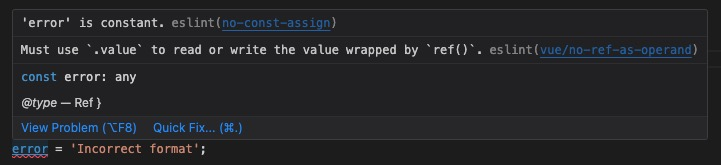
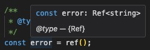
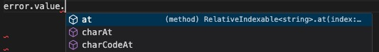

# fractalpm-v3-vue DevOps

## Libraries. Tech Stack

- TBD

### Testing

- explained in [Readme](../README.md)

### Errors Prevention. IntelliSense (Auto-complete). Documenting (JSDoc). Type hinting

- <https://jsdoc.app/tags-type>
- <https://jsdoc.app/tags-param>
- <https://jsdoc.app/tags-returns>
- **IntelliSense (Auto-complete)** and Eslint **error detection** are enabled through JSDoc and accompanied installed VSC extensions (guide in: Readme / Recommended IDE Setup)
- to enable it all, code should be JSDoc documented properly. Following Guides / Patterns show you how:

#### Guide / Pattern #1 - Vue (Ref, ...) & Types not exported

If you don't activate this pattern but simply do:

```js
import { ref } from 'vue';
const error = ref();
error = 'Incorrect format';
```

... then the above error of not assigning to `error.value` gets unnoticed!

Instead we go for

```js
import { ref, Ref } from 'vue';
/**
 * @type {Ref<string>}
 */
const error = ref();
error = 'Incorrect format';
```

By informing eslint of the `error` const type, we get an error indication:



We also get type inf on hovering:



But more important, the *intellisense / autocomplete* **speeds up our development and avoids mistyping**:



The only caveat is that the `Ref` type is exported as a part of `*.d.ts` typing that are not accessible to JS code so we ger the error:
`SyntaxError: The requested module '/node_modules/.vite/deps/vue.js?v=603245f2' does not provide an export named 'Ref'`
To solve this, we omit `Ref` import and us it in `@type` as `import('vue').Ref`:

```js
import { ref } from 'vue';
/**
 * @type {import('vue').Ref<string>}
 */
const error = ref();
error.value = 'Incorrect format';
```

More examples of this:

```js
import axios from 'axios';
/**
 * @type {import('axios').AxiosInstance}
 */
const apiClient = axios.create({ ...
```

#### Guide / Pattern  #2 - Types (Classes) Definition and usage

How to document a class to be reused: [src/models/users/Person.js](../src/models/users/Person.js) file:

```js
/**
 * @class
 */
export default class Person {
  /**
   * The unique identifier for the person.
   * @type {(string | undefined)}
   */
  id;

  // ...

  /**
   * The password of the person.
   * @type {string}
   */
  password;

  /**
   * Creates a new instance of the Person class.
   * @param {(string | undefined)} id - The unique identifier for the person.
   * @param {string} firstName - The first name of the person.
   * @param {string} lastName - The last name of the person.
   * @param {string} email - The email address of the person.
   * @param {string} password - The password of the person.
   */
  constructor (firstName, lastName, email, password, id = undefined) {
    this.firstName = firstName;
    this.lastName = lastName;
    this.email = email;
    this.password = password;
    this.id = id;
  }

  /**
 * a static method
 * @returns {Person} A mock instance of the Person class.
 */
  static get PersonMock () {
    return {
      id: '1', // TODO: to fit type
      firstName: 'Sinisa',
      lastName: 'Rudan',
      email: 'sinisa.rudan@gmail.com',
      password: 'pass'
    };
  }

// ...
}
```

- a code that uses the class `Person`, e.g. [UserService.js](../src/services/UserService.js) should import it and then use it in definition of `@param {Person}` or `@type {Person}` as below:

```js
import Person from '@/models/users/Person';
// ...

export class UserService {
// ...
/**
   * Register a user.
   * @param {Person} user - The user to register.
   * @returns {Promise<Person>} A promise that resolves to the registered user.
   */
  static register (user) {
    //... above documenting enables autocomplete for `user.id`
    user.id = Person.PersonInit;
```

### Styling. Formatting

#### Rules

- SEMICOLON `;` always required: **rule**: `semi: ['error', 'always']`

#### Importing types just for JSDoc typing causing ERROR `... is declared but its value is never read.ts(6133)`

- solved by installing `eslint-plugin-jsdoc`
- adding it to Eslint config (`.eslintrc.cjs` file):

```js
plugins: [
    'jsdoc',
    ...
  ],
  rules: {
    'jsdoc/no-undefined-types': 1,
    ...
  }
```

#### JSDoc typing with a type that is not available to JS (being a part of `index.d.ts`)

If we try the standard approach:

```js
import axios, { AxiosInstance } from 'axios';

/**
 * @type {AxiosInstance}
 */
const apiClient = axios.create({
  baseURL: BASE_URL,
  headers: {
    'Content-type': 'application/json'
  }
});
```

it will raise a RTE: `Uncaught SyntaxError: The requested module '/node_modules/.vite/deps/axios.js?v=370d0514' does not provide an export named 'AxiosInstance'`

We solve it by omitting the `AxiosInstance` import and typing it as `{import('axios').AxiosInstance}`:

```js
import axios from 'axios';
/**
 * @type {import('axios').AxiosInstance}
 */
const apiClient = axios.create({
  baseURL: BASE_URL,
  headers: {
    'Content-type': 'application/json'
  }
});
```

@type {import('axios').AxiosInstance}

#### eslint

- started by: `npm init @eslint/config`
- config:

```txt
✔ How would you like to use ESLint? · style
✔ What type of modules does your project use? · esm
✔ Which framework does your project use? · vue
✔ Does your project use TypeScript? · No / Yes
✔ Where does your code run? · browser
✔ How would you like to define a style for your project? · guide
✔ Which style guide do you want to follow? · standard
✔ What format do you want your config file to be in? · JavaScript
Checking peerDependencies of eslint-config-standard@latest
Local ESLint installation not found.
The config that you've selected requires the following dependencies:

eslint-plugin-vue@latest eslint-config-standard@latest eslint@^8.0.1 eslint-plugin-import@^2.25.2 eslint-plugin-n@^15.0.0 || ^16.0.0  eslint-plugin-promise@^6.0.0
✔ Would you like to install them now? · No / Yes
✔ Which package manager do you want to use? · pnpm
Installing eslint-plugin-vue@latest, eslint-config-standard@latest, eslint@^8.0.1, eslint-plugin-import@^2.25.2, eslint-plugin-n@^15.0.0 || ^16.0.0 , eslint-plugin-promise@^6.0.0

devDependencies:
+ eslint 8.53.0
+ eslint-config-standard 17.1.0
+ eslint-plugin-import 2.29.0
+ eslint-plugin-n 16.3.1
+ eslint-plugin-promise 6.1.1
+ eslint-plugin-vue 9.18.1
```

## System Design

### Model

#### Typescript

if you are looking **JS project** you can skip this

- for models we use VOs (Value Objects) we don't use **Classes**, with methods to operate with them. Instead, we rely on `interface`-s stored in `VO_NAME-vos.ts` files and accompanied with `VO_NAME-operators.ts` that operate with it, to handle it.
  - this is for the reason of marshalling interfaces between frontend and backend; plain data without any behavioral logic; while keeping strong typing through interfaces instead of serialized classes
  - Another, a bit more demanding approach, would be to use classes for all frontend work but accompanied by VO's interface and `serialize` method that serializes class into that interface (e.g. for sending to server)
  - this approach can be discussed and adjusted
